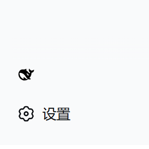
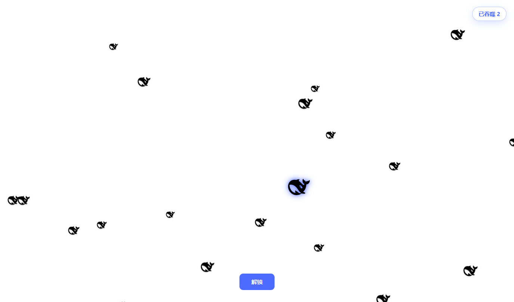

# dsh-gate-game

一个 [DeepSeek Harness](https://github.com/deepseek-ai/deepseek-harness) 的**标准 Cordis 客户端插件**，给 Web UI 加上吃 logo 小游戏和一键锁屏按钮。

## 效果预览

**侧栏底部的锁屏按钮**（DeepSeek logo）：



**点击锁屏后的游戏画面**——天上掉小 logo，用鼠标（大 logo）去吃：



## 功能

- **锁屏按钮**：侧栏底部出现一个 DeepSeek logo 按钮，点击即锁屏（全屏覆盖层）。
- **吃 logo 游戏**：锁屏期间，小 DeepSeek logo 从天而降。移动鼠标（一个发光的大 logo）去吃它们。吃得越多长得越大——直到撑爆 💥。
- **越吃越胖**：无上限加速膨胀，变大后变红颤抖预警，撑到极限爆裂（碎片四溅 + 冲击波 + 白屏闪光），然后弹性重生。
- **解锁**：点击"解锁"按钮关闭覆盖层，回到会话。
- **桌面快捷方式**：安装并启动 `dsh web` 后，自动在**桌面**生成一个指向本地 Web UI 的快捷方式（跨平台：Windows 为 `.url` 带 DeepSeek logo 图标，macOS 为 `.webloc`，Linux 为 `.desktop`），一键直达。幂等——已存在则跳过。

> 这是**插件版**（游戏 + 锁屏）。另有注入版工具可加密码门（在应用加载前拦截），但那无法通过 Cordis 插件实现（插件运行在已加载的应用内部）。

### 可选配置

插件支持在 Cordis entry 配置里关闭快捷方式、改名：

| 配置项         | 类型      | 默认值                | 说明                         |
| -------------- | --------- | --------------------- | ---------------------------- |
| `shortcut`     | `boolean` | `true`                | 是否创建桌面快捷方式         |
| `shortcutName` | `string`  | `"DeepSeek Harness"`  | 快捷方式文件显示名           |

例如：

```yaml
dsh-gate-game:
  shortcut: true
  shortcutName: "DeepSeek Harness"
```

## 安装

```bash
dsh plugin --profile web add github:CochraneK/dsh-gate-game-plugin
```

或从本地目录安装：

```bash
dsh plugin --profile web add ./dsh-gate-game-plugin
```

安装后重启 `dsh web`，侧栏底部即出现锁屏按钮。

## 环境要求

- DeepSeek Harness `v0.1.0-rc.7`（开发者预览版）
- Web profile（`dsh web`）

## 实现原理

这是一个标准 Cordis 客户端插件：

- `package.json` 声明 `dsh.client`（`platform: "web"`）和 `dsh.bundle.patch`，`dsh plugin add` 会将其注册为 profile 层，模块注册表自动扫描进 `window.__DSH_BOOT__`。
- `lib/index.js` — node 半。除空 UI 挂载外，在服务端 `webServer` 监听后等待端口就绪，自动在桌面创建指向本地 Web UI 的快捷方式（跨平台，带 DeepSeek logo 图标），并提供 `shortcut` / `shortcutName` 配置开关。
- `lib/client.js` — 浏览器半，通过 `window.__ModuleLoader__.load` 注册。注入 CSS 并将 `LockButton` 组件注册到 `sidebar.footer.action` slot。
- `cordis.patch.yml` — 插入 node 半 entry。

不修改任何应用代码，完全通过官方 slot 系统挂载。

## 许可证

MIT
